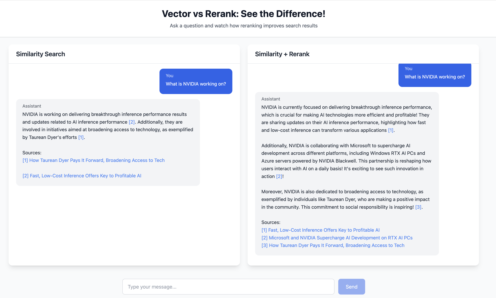

# Vector vs Rerank: Interactive RAG Demo

This demo showcases the difference between vector similarity search and reranking in RAG (Retrieval Augmented Generation) applications. It provides a side-by-side comparison of search results, demonstrating how reranking can improve result relevance.



## Features

- **Split-screen Comparison**: See vector similarity search vs reranked results side by side
- **Real-time Chat Interface**: Interactive Q&A with both search methods
- **Source Attribution**: Automatic citation linking to source documents
- **Markdown Support**: Rich text formatting in responses
- **Configurable Search**: Adjustable parameters for vector search and reranking

## Getting Started

### Prerequisites

- Python 3.9+
- Node.js 18+
- Pinecone API key
- OpenAI API key

### Installation

1. Clone the repository:

   ```bash
   git clone https://github.com/your-username/vector-vs-rerank.git
   cd vector-vs-rerank
   ```

2. Set up the backend:

   ```bash
   cd backend
   python -m venv .venv
   source .venv/bin/activate  # On Windows: .venv\Scripts\activate
   pip install -r requirements.txt
   ```

3. Set up the frontend:

   ```bash
   cd frontend
   npm install
   ```

4. Configure environment variables:
   
   ```bash
   cp .env.local.example .env.local
   # Edit .env.local with your API keys
   ```

### Running the Demo

1. Start the backend server:

   ```bash
   cd backend
   uvicorn app:app --reload --port 5328
   ```

2. In a new terminal, start the frontend:

   ```bash
   cd frontend
   npm run dev
   ```

3. Open [http://localhost:3000](http://localhost:3000) in your browser

## How It Works

1. **Vector Search**: Uses Pinecone's vector similarity search to find relevant documents
2. **Reranking**: Applies cross-attention reranking to improve result relevance
3. **LLM Integration**: Uses GPT-4 to generate natural responses with proper source attribution
4. **Real-time Updates**: Shows both search methods working simultaneously

## Configuration

Key configuration options in `.env.local`:

```env
PINECONE_API_KEY=your_key_here
PINECONE_INDEX_NAME=your_index
PINECONE_ENVIRONMENT=your_environment
OPENAI_API_KEY=your_key_here
PINECONE_EMBEDDING_MODEL=model_name
PINECONE_RERANK_MODEL=model_name
```

## Contributing

Contributions are welcome! Please feel free to submit a Pull Request.

## License

This project is licensed under the MIT License - see the [LICENSE](LICENSE) file for details.